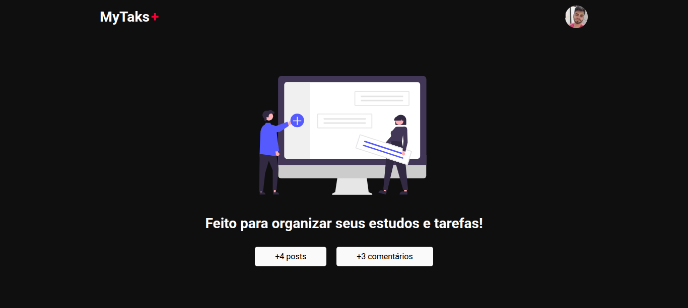
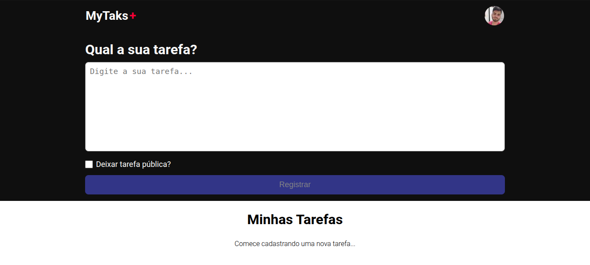
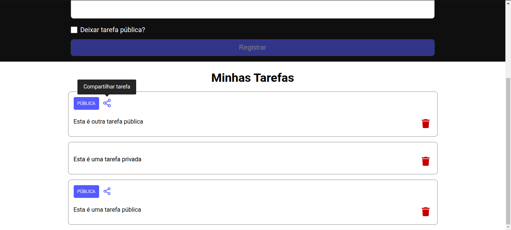
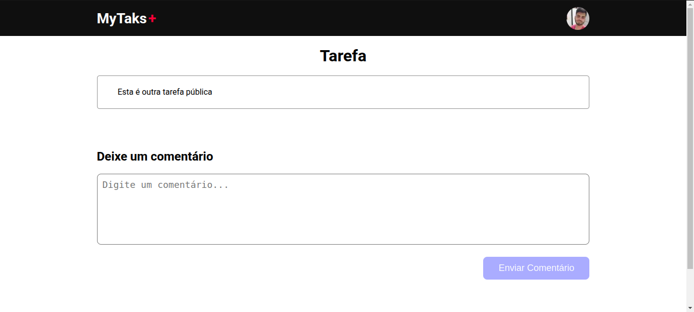
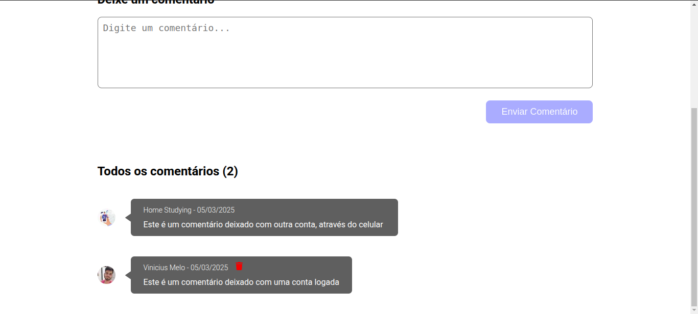
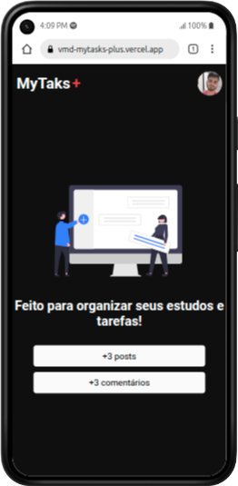
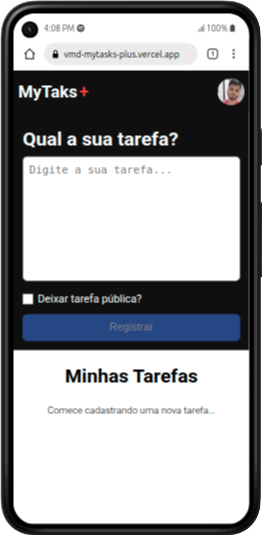
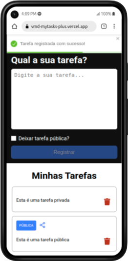
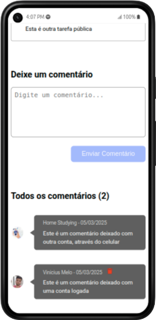

# MyTasks+ 📝

Neste projeto pessoal, desenvolvi uma pequena plataforma interativa de gerenciamento de tarefas.

Para acessar, é necessário realizar o login na ferramenta, no qual é feito pela conta do google. Após autenticar, a pessoa terá acesso à um dashboard no qual poderá cadastrar suas tarefas, podendo escolher entre as opções de deixá-las públicas ou privadas.

Caso a tarefa seja pública, outras pessoas poderão acessá-las através de um link compartilhável e interagir deixando comentários, atualizados em tempo real, sobre o que acharam de determinada tarefa. A pessoa que realizou o comentário também tem a opção de excluí-lo posteriormente. Comentários não podem ser feitos de forma anônima, portanto um login é requerido para deixar uma opinião.

## Deploy Link 🌐

### Acesse o deploy do meu projeto 👉 [Vercel](https://vmd-mytasks-plus.vercel.app/)

## Tabela de Conteúdos

- [Visão Geral](#overview)
  - [O desafio](#o-desafio)
  - [Screenshots](#Screenshots)
- [Desenvolvimento](#desenvolvimento)
  - [Características Técnicas](#características-tecnicas)
- [Autor](#autor)

## Visão Geral 🔎

## O desafio

#### Funcionalidades para a pessoa usuária

- Autenticação através da conta do Google.
- Cadastrar suas tarefas, escolhendo entre deixá-las públicas ou privadas.
- Compartilhar suas tarefas públicas com quem quiser, através de um link.
- Excluir uma tarefa.
- Acessar a página de detalhes da tarefa.
- Deixar comentários e interagir em tempo real com outras pessoas, caso tenha logado.
- Ver a lista de músicas favoritadas.
- Ver o perfil da pessoa logada.
- Editar o perfil da pessoa logada.

## Desenvolvimento

#### Características Técnicas (Stacks usadas) 🧑‍💻

- HTML5 Semântico
- CSS Modules
- Flexbox
- Typescript
- Next.js
- SSG (Static Site Generator)
- SSR (Server Side Rendering)
- Autenticação utilizando NextAuth.js
- React Toastify (Disparo de alertas)
- Conexão em real-time com banco de dados Firebase
- Gerenciamento de estado de componente
- Aplicação de regras de negócio
- Design 100% responsivo

## Screenshots 📷

### Visualização no PC:

---------------------------

---------------------------

---------------------------

---------------------------

### Visualização Mobile:

---------------------------

---------------------------

---------------------------

## Autor

- Vinicius Melo: [LinkedIn](https://www.linkedin.com/in/vinicius-s-melo/)
